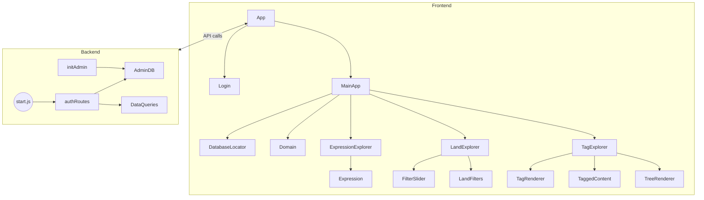

# Cartographie complète de l’application

## Structure des dossiers

- **client/** : Frontend React (interface utilisateur)
  - **src/**
    - **index.js** : Point d’entrée React
    - **serviceWorker.js** : Gestion du service worker (PWA)
    - **setupTests.js** : Setup des tests
    - **app/**
      - **Context.js** : Contexte global de configuration (ConfigContext)
      - **Util.js** : Fonctions utilitaires (ex: delay)
    - **components/**
      - **App/** : Composant principal App, MainApp, gestion login
      - **DatabaseLocator/** : Sélection de la base de données
      - **Domain/** : Gestion d’un domaine (Domain)
      - **ExpressionExplorer/** : Gestion des expressions (Expression, ExpressionExplorer)
      - **LandExplorer/** : Exploration de “lands” (LandExplorer, FilterSlider, LandFilters)
      - **TagExplorer/** : Exploration et rendu des tags (TagExplorer, TagRenderer, TaggedContent, TreeRenderer)

- **server/** : Backend Node.js (API, logique métier)
  - **src/**
    - **AdminDB.js** : Gestion des utilisateurs/admins, logs, tentatives, tokens, accès
    - **DataQueries.js** : Fonctions SQL pour manipuler les données (expressions, tags, etc.)
    - **initAdmin.js** : Création de l’admin initial, génération de mot de passe
    - **authRoutes.js** : Routes d’authentification (login, reset, etc.)
    - **migrations_auth.sql** : Script SQL de migration
    - **start.js** : Point d’entrée serveur

- **Divers**
  - **package.json / yarn.lock** : Dépendances
  - **Dockerfile** : Conteneurisation
  - **README.md** : Documentation projet

---

## Fonctions principales et leurs rôles

### Frontend (client/src)

#### serviceWorker.js
- `register(config)` : Enregistre le service worker (PWA)
- `unregister()` : Désenregistre le service worker

#### app/Context.js
- `ConfigContext` (class) : Fournit le contexte global de configuration à l’app
- `tagsHaveChanged(a, b, d)` : Compare des tags

#### app/Util.js
- `delay(time, callback, arg)` : Exécute un callback après un délai

#### components/App/App.js
- `MainApp()` : Ancien contenu de App, logique principale
- `App()` : Composant principal, gère l’état global et le login
- `handleLogin(userData)` : Callback de connexion

#### components/DatabaseLocator/DatabaseLocator.js
- `DatabaseLocator()` : Permet à l’utilisateur de choisir une base de données

#### components/Domain/Domain.js
- `Domain(props)` : Affiche et gère un domaine

#### components/ExpressionExplorer/Expression.js
- `Expression(props)` : Affiche et édite une expression
  - `saveBeforeQuit`, `onTextChange`, `selectText`, `deleteExpression`, `getReadable`, `saveReadable`, `reloadExpression`, `deleteMedia` : Fonctions internes pour manipuler une expression

#### components/ExpressionExplorer/ExpressionExplorer.js
- `ExpressionExplorer()` : Liste et navigue entre les expressions
  - `setPrevPage`, `setNextPage`, `groupSelect`, `checkSelected`, `dropSelected`, `sortHint` : Fonctions de navigation/groupement

#### components/LandExplorer/LandExplorer.js
- `LandExplorer()` : Affiche et gère l’exploration des “lands”
  - `switchLand(event)` : Change de “land”

#### components/LandExplorer/FilterSlider.js
- `FilterSlider({label, min, max, defaultValue, apply})` : Slider de filtre
  - `handleChange(event)` : Gère le changement de valeur

#### components/LandExplorer/LandFilters.js
- `LandFilters()` : Filtres pour les “lands”
  - `onChangeRelevance(value)`, `onChangeDepth(value)` : Gèrent les filtres

#### components/TagExplorer/TagExplorer.js
- `TagExplorer()` : Affiche et gère l’exploration des tags
  - `getNodeKey`, `handleClose` : Fonctions internes

#### components/TagExplorer/TagRenderer.js
- `TagRenderer(props)` : Affiche un tag

#### components/TagExplorer/TaggedContent.js
- `TaggedContent({tags, forLand})` : Affiche le contenu taggé
  - `handleClose`, `handleShow`, `deleteTaggedContent`, `getFiltered` : Fonctions internes

#### components/TagExplorer/TreeRenderer.js
- `TreeRenderer` (class) : Affiche l’arbre des tags
  - `render()` : Rendu de l’arbre

#### Authentification
- `Login({onLogin})`, `ForgotPassword()`, `ResetPassword()` : Composants d’authentification
  - `handleSubmit`, `toggleShowPassword` : Fonctions de gestion de formulaire

---

### Backend (server/src)

#### AdminDB.js
- `connectAdminDB(dbPath)` : Connexion à la base admin
- `addUser(user, callback)` : Ajoute un utilisateur
- `incrementFailedAttempts(userId, maxAttempts, callback)` : Incrémente les tentatives échouées
- `resetFailedAttempts(userId, callback)` : Réinitialise les tentatives
- `findUser(identifier, callback)` : Recherche un utilisateur
- `updateLastSession(userId, callback)` : Met à jour la dernière session
- `addAccessLog(log, callback)` : Ajoute un log d’accès
- `setUserBlocked(userId, blocked, until, callback)` : Bloque/débloque un utilisateur
- `getAccessLogs(userId, callback)` : Récupère les logs d’accès
- `setResetToken(email, token, expires, callback)` : Définit un token de reset
- `findUserByResetToken(token, callback)` : Recherche un utilisateur par token
- `resetPassword(userId, newHash, callback)` : Réinitialise le mot de passe

#### DataQueries.js
- `placeholders(params)` : Génère des placeholders SQL
- `getSiblingExpression(offset, req, res)` : Récupère une expression voisine
- `normPath(filename)` : Normalise un chemin
- `buildTagTree(rows)` : Construit l’arbre des tags
- `walk(tags, parentId)` : Parcours récursif des tags

#### initAdmin.js
- `generatePassword(length)` : Génère un mot de passe
- `logPassword(pwd)` : Log le mot de passe
- `createAdminIfNeeded()` : Crée l’admin si besoin

---

## Schéma des appels de fonctions (simplifié)

---

## Résumé

Ce document donne une vue d’ensemble de l’architecture, des fichiers, des fonctions principales, et des relations d’appel de l’application.  
Chaque composant/fichier a un rôle précis, et l’architecture sépare clairement frontend (React) et backend (Node.js/Express/SQLite).
